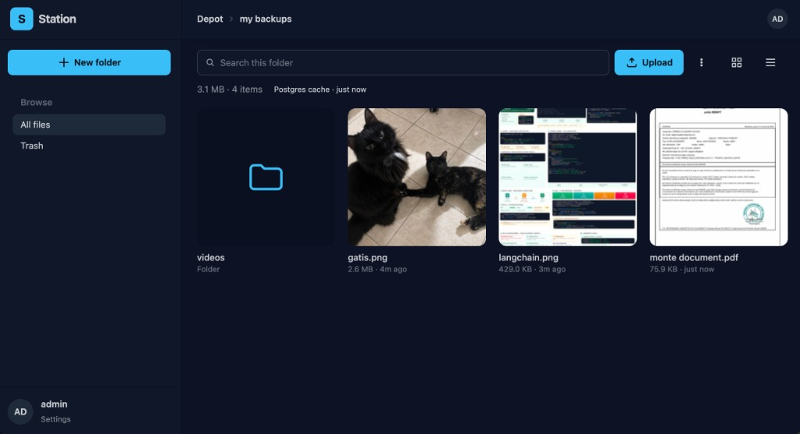
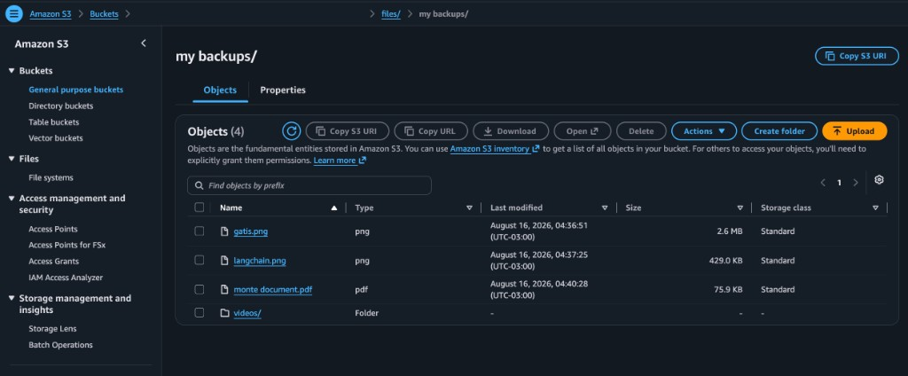

# S3 Station

A small Nextcloud-style browser for an **existing S3 bucket**. Station is not a second copy of your files. The bucket is the depot: what you see in the UI is what lives in S3.



User objects sit under **`files/`** (`FILES_PREFIX`). Station-only data stays next to that prefix so other tools can share the same bucket:

| Prefix | Role |
| --- | --- |
| `files/` | Your folders and files (the depot) |
| `.station-trash/` | Soft-deleted objects (still in the bucket) |
| `.station-thumbs/` | Generated WebP previews |

## One-to-one with the bucket

Station treats S3 as the source of truth.

- **No file store on the app server.** Uploads, downloads, and previews go to S3. The Go process never keeps a copy of the object body (except short-lived work for zip downloads and thumbnail generation).
- **Every UI action is an S3 action.** Create folder, upload, rename, move, trash, restore, and permanent delete all read or write the bucket. The folder tree you browse is the prefix tree under `files/`.
- **Listings are a cache, not a second database of files.** Postgres remembers the last listing of each folder so opening it is fast. The cache can be stale if something else wrote to the bucket. **Reload folder from the bucket** drops that folder’s cache and lists S3 again. Opening a folder that was never cached always reads the bucket.
- **You can use the bucket without Station.** AWS console, `aws s3`, rclone, or another app can add or remove objects under `files/`. After that, reload the folder (or clear the listing cache in Settings) and Station shows the same tree.

It is not a background sync client (no watch loop, no two-way replica). It is a 1:1 window onto one prefix in one bucket.

The same folder in the AWS console — `files/my backups/` — is the same objects Station shows in the grid:



## Stack

| Layer | What |
| --- | --- |
| Server | Go, [Chi](https://github.com/go-chi/chi) |
| HTML | [templ](https://templ.guide) (server-rendered fragments) |
| UI updates | [Datastar](https://data-star.dev) (`datastar-go` + the local `/static/js/datastar.js`) |
| Style | Tailwind CSS 4 + DaisyUI 5 (`data-theme="night"`) |
| Object store | AWS S3 (or S3-compatible) via aws-sdk-go-v2 |
| Listing cache | Postgres (`pgx`) |
| Sessions / prefs | Redis |
| Thumbs | imaging (images), ffmpeg on the host (video stills) |
| Dev | [Air](https://github.com/air-verse/air), Task, Docker Compose |

There is no React/Vue/SPA build. The first paint is HTML from templ. After that, Datastar patches pieces of the page over SSE.

## Datastar

[Datastar](https://data-star.dev) drives in-page UI: folder navigation, modals, flashes, selection, and trash/settings actions. Signals live on the page root (`data-signals`). Clicks and submits run expressions (`@get`, `@post`) that send the current signals to Go. Handlers reply with SSE: replace `#file-panel` / `#crumbs` / `#meta-bar` (or `#trash-panel`) and patch signals (`prefix`, `_busy`, `_flash`, …).

Examples:

- Open a folder: `$prefix = "photos/"; @get('/files')` → listing patch + `history.pushState` to `/files/photos/`
- Trash or move: `@post('/files/trash')` / `@post('/files/move')` with `$targetKey` or `$selected`
- Multi-select: `$selected` is a **string array** of object keys (not a map — Datastar nests object keys on `.`)

**Not Datastar:** S3 uploads, drag-and-drop, the image/video/PDF gallery, and browser back/forward. Those are small vanilla scripts (`upload.js`, `gallery.js`, `nav.js`) that talk to JSON/binary endpoints or dispatch `CustomEvent`s (`station-uploaded`, `station-navigate`) which Datastar then handles.

Do not use `@get` / `@post` for zips, thumb bytes, or the presigned-upload handshake — those are `fetch`, `XMLHttpRequest`, or a normal `<a href>`.

## Presigned URLs

The browser talks to S3 with **presigned URLs**. Station holds the AWS keys; the browser never sees them.

### Upload

1. You drop files or use **Upload**.
2. The browser asks Station for a short-lived **presigned PUT** (`POST /uploads/presign`) for each object: key, content type, size.
3. The file is sent **straight to S3** with `PUT` on that URL (progress is reported from the browser). The bytes do not pass through Station.
4. When the PUTs finish, the browser calls `POST /uploads/complete`. Station heads the new objects and updates the Postgres listing cache so the grid matches the bucket.

Because the `PUT` is cross-origin, the bucket needs **CORS** (see below). `PRESIGN_TTL` and `MAX_UPLOAD_BYTES` cap how long a URL is valid and how large a file may be.

### Download and preview

Images, video, audio, and PDFs open with a **presigned GET**. Download uses a separate presigned URL with a `Content-Disposition` filename. Those links expire; they are not public bucket URLs.

Folder and multi-select **Download** build a zip on the server by reading the selected keys from S3 (that path cannot be a single browser PUT).

### Other S3 work Station does

- **Move / rename** — copy then delete in the bucket, then refresh the cache.
- **Trash** — copy into `.station-trash/`. Objects stay in S3 until you permanently delete them in Trash or Settings.
- **Thumbnails** — WebP stills written under `.station-thumbs/` and served by the app (`GET /thumbs/…`). Images and the first page of a PDF use the same card thumb. Video frames can be regenerated to pick a different still. PDF thumbs need `pdftoppm` (poppler), `mutool`, or ImageMagick on the server.
- **Folder zip** — Station lists the prefix and streams a zip of those objects.

## What you can do in the UI

- Sign in with `AUTH_USERNAME` / `AUTH_PASSWORD`
- Browse with pretty URLs (`/files/photos/italy/`), grid or list, search in the current folder
- Create folders (names are stored **lowercase**), upload files or whole folders, drag to move
- Select several items: download zip, move, or trash
- Fullscreen gallery for images and video; PDFs open the browser PDF reader fullscreen
- Optional **folder passwords** (UI-only: they hide a folder in Station, they do not encrypt the bucket)
- Trash and Settings for restore, empty trash, listing-cache purge, and thumbnail purge

## Run

```bash
cp .env.example .env
# fill AWS_ACCESS_KEY_ID, AWS_SECRET_ACCESS_KEY, AWS_REGION, S3_BUCKET
docker compose up --build
```

Open [http://localhost:8080](http://localhost:8080).

The app container runs [Air](https://github.com/air-verse/air) with the repo mounted, so edits to `.go`, `.templ`, `.css`, and `.js` regenerate templ and restart the server.

Compose starts **Postgres**, **Redis**, and the app. It does not create a bucket — point `S3_BUCKET` at one you already have. For MinIO or another S3-compatible API, set `S3_ENDPOINT` (and `S3_PUBLIC_ENDPOINT` if the browser must reach a different URL than the server).

Without Docker for the app (Task starts Postgres and Redis, then Air):

```bash
task dev
```

Other Task commands: `task generate`, `task server`, `task kill`, `task test:go`, `task docker:up`.

## S3 CORS

Browser uploads are `PUT`s to the presigned URL, so the bucket must allow your origin. Example:

```json
[
  {
    "AllowedOrigins": ["http://localhost:8080"],
    "AllowedMethods": ["GET", "PUT", "HEAD"],
    "AllowedHeaders": ["*"],
    "ExposeHeaders": ["ETag", "Content-Length"],
    "MaxAgeSeconds": 3000
  }
]
```

Use your real origin in production (and `COOKIE_SECURE=true` behind HTTPS).

## Local Go

```bash
task generate
task server
```

Needs Postgres and Redis on the URLs in `.env`, plus credentials that can list, get, put, copy, and delete in `S3_BUCKET`.
